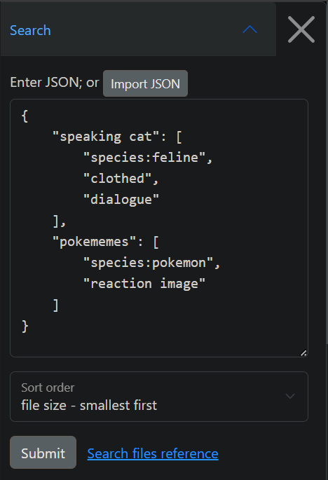
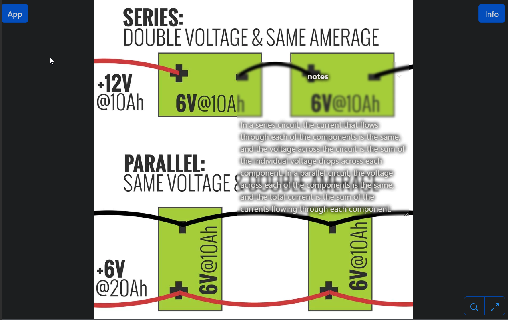
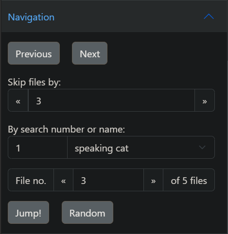
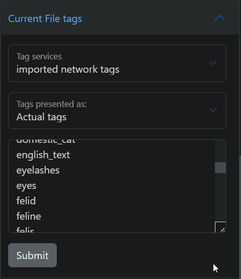

# Hydrus Slideshow Viewer
<p align="center">
  
</p>

Hydrus Slideshow Viewer (HSV) is a slideshow web application for the [Hydrus Client](https://github.com/hydrusnetwork/hydrus), which must be accessible over the network.

## Features
- Installable or Self Hostable
    - Visit and use the [Github site](https://mruac.github.io/hydrus-slideshow-viewer), then [Install](https://developer.mozilla.org/en-US/docs/Web/Progressive_web_apps/Guides/Installing#installing_pwas)
    - Self-host with NodeJS
    ```bash
    cd ./hydrus-slideshow-viewer
    npm install
    node app.js
    # access at https://127.0.0.1:3415
    ```
    - Docker
    ```docker
    cd ./hydrus-slideshow-viewer
    docker build -t hydrus-slideshow-viewer .
    docker run --name hydrus-slideshow-viewer -d -p {PORT_NUMBER}:3415 hydrus-slideshow-viewer
    ```
- Works without the internet (provided you can still access the client API), as all information is processed client-side.
- Shows multiple _named_ searches side by side, in slideshow format  
  
- Draggable/resizeable floating notes  
  
- Navigation features (skip by _n_ files, random, jump to search)  
  
- Edit tags for the current file (Only editable in "Actual tags")  
  

# Notes
- This project is passively worked on. If you have identified an issue or feature, please raise an issue.
- If the site is served over HTTPS, the Client API URL must be HTTPS due to browser restrictions.